# AgentOS Community

This repository is the hub of the AgentOS community—open-source adapters, components, apps, and agent configs for [AgentOS](https://github.com/jcontini/agentOS-core).

---

## What is AgentOS?

**AgentOS is the semantic layer between AI assistants and your digital life.**

Your tasks are in Todoist. Your calendar is in Google. Your messages are split across iMessage, WhatsApp, Slack. Your files are everywhere. Each service is a walled garden—they don't talk to each other, and switching is painful.

**AgentOS fixes this.** It gives AI assistants a unified way to access all your services through a universal language. Your AI can manage tasks, read your calendar, send messages, and search the web—all through one interface, regardless of which service you use.

### The Vision

**You should own your digital life.** Not rent it. Not have it held hostage. Own it.

AgentOS creates a universal entity model—tasks, events, contacts, messages, files—that works across all services. A Todoist adapter maps Todoist's API to the universal `task` entity. A Linear adapter does the same. From your AI's perspective, they're identical: `task.list()`, `task.create()`, `task.complete()`.

This means:
- **Migration is trivial** — Switch from Todoist to Linear? Same entity, different backend
- **Cross-service queries work** — "Show tasks due today from all sources"
- **AI understands everything** — One schema, not 50 proprietary formats
- **You're in control** — Your data, your computer, your rules

### How It Works

```mermaid
%%{init: {'theme': 'dark', 'themeVariables': { 'fontSize': '16px', 'fontFamily': 'ui-monospace, monospace', 'lineColor': '#6b7280', 'primaryTextColor': '#f3f4f6' }}}%%
flowchart LR
    Entity(["📋 Entity<br/><small>schema + views + components</small>"])
    Adapter(["⚡ Adapter<br/><small>reddit · youtube · todoist</small>"])
    Cloud(["☁️ Cloud Services<br/><small>Reddit · YouTube · Todoist</small>"])
    Local(["💻 Your Computer<br/><small>Calendar · Contacts · iMessage</small>"])
    Framework(["🧩 Framework<br/><small>list · text · layout</small>"])
    Theme(["🎨 Theme<br/><small>Mac OS 9 · Windows 98</small>"])
    
    Adapter -->|"provides"| Entity
    Adapter -->|"connects to"| Cloud
    Adapter -->|"connects to"| Local
    Entity -->|"uses"| Framework
    Theme -->|"styles"| Entity
    
    style Entity fill:#064e3b,stroke:#10b981,stroke-width:2px,color:#d1fae5
    style Adapter fill:#064e3b,stroke:#10b981,stroke-width:2px,color:#d1fae5
    style Cloud fill:#134e4a,stroke:#14b8a6,stroke-width:2px,color:#ccfbf1
    style Local fill:#134e4a,stroke:#14b8a6,stroke-width:2px,color:#ccfbf1
    style Framework fill:#374151,stroke:#9ca3af,stroke-width:2px,color:#f3f4f6
    style Theme fill:#374151,stroke:#9ca3af,stroke-width:2px,color:#f3f4f6
    
    linkStyle 0,1,2 stroke:#10b981,stroke-width:2px
    linkStyle 3,4 stroke:#a78bfa,stroke-width:2px
```



**Entities are self-contained.** They define their own views and components. The viewer shell just renders whatever entity is active.

### What You Can Do

- **Let AI manage your tasks** — "Create a task to review the PR" → Done
- **Cross-service queries** — "What did I discuss with Sarah last week?" → Searches messages, emails, calendar
- **Unified calendar** — See events from Google Calendar, Apple Calendar, Outlook in one place
- **Smart workflows** — "Every morning, summarize unread emails and add tasks for action items"
- **Easy migration** — Switch from Todoist to Linear without losing data or relationships

### For Everyone

**You don't need to be technical to use AgentOS.** Enable adapters, connect your services, and your AI assistants can use them. The community builds the adapters—you just use them.

**You don't need to code to contribute.** Found a bug? Want a new adapter? Have an idea? Open an issue. The community is here to help.

---

## What's Here

This repository contains everything the AgentOS community builds:

```
entities/          Self-contained packages (schema + views + components)
adapters/           Service adapters (Reddit → post, YouTube → video, etc.)
themes/            Visual styling (CSS)
agents/            Setup instructions for AI clients (Cursor, Claude, etc.)
```

### Entities = Apps

**Key insight:** Entities ARE apps. Each entity is a self-contained package with:
- **Schema** — properties, operations
- **Views** — how to render each operation
- **Components** — the UI pieces

When you install a adapter that uses `post`, you effectively get a "Posts" app.

```
entities/
  posts/                    # Entity folder (new format)
    entity.yaml             # Schema + views
    components/
      post-item.tsx         # List item
      post-header.tsx       # Detail view header
      comment-thread.tsx    # Nested comments
  
  tasks.yaml                # Legacy format (being migrated)
  videos.yaml
  webpages.yaml
```

### Adapters

Service adapters that transform API responses into entities.

```
adapters/
  reddit/
    readme.md       # YAML config + markdown docs
    icon.png        # Square icon
    tests/          # Integration tests
  youtube/
  todoist/
  ...
```

| Adapter | Entity | What it provides |
|--------|--------|------------------|
| reddit | post | Posts and comments from Reddit |
| youtube | video | Video metadata and transcripts |
| todoist | task | Tasks and projects |
| exa | webpage | Web search and content |
| apple-calendar | event | Calendar events |

### Themes

Visual styling for the desktop environment.

```
themes/
  os/
    macos9/         # Mac OS 9 theme
    win98/          # Windows 98 theme
```

### Agents

Setup instructions for AI clients that use AgentOS.

```
agents/
  cursor/           # Cursor IDE setup
  claude/           # Claude Desktop setup
```

---

## Contributing

**Anyone can contribute.** You don't need to code. Found a bug? Want a new adapter? Have an idea? [Open an issue](https://github.com/jcontini/agentos-community/issues) or see [CONTRIBUTING.md](CONTRIBUTING.md) for how to build adapters.

**The community builds everything.** Adapters, components, apps, themes—all open source, all MIT licensed, all yours forever.

---

## License

**MIT** — see [LICENSE](LICENSE)

By contributing, you grant AgentOS the right to use your contributions in official releases, including commercial offerings. Your code stays open forever. See [CONTRIBUTING.md](CONTRIBUTING.md) for full terms.

---

## App Store

**The AgentOS App Store fetches items directly from this repository.** No backend servers, no infrastructure costs—GitHub IS the backend.

When you add or modify adapters/models/themes/components, a GitHub Action automatically:
1. Scans the repository structure
2. Reads metadata from YAML front matter
3. Generates an updated `manifest.json`
4. Commits it back to the repo

**You never touch `manifest.json` manually!** Just add your files and the manifest updates automatically.

### Installing Items

From the AgentOS UI (coming soon):
- Browse adapters, apps, themes, components
- Click "Install" → downloads to `~/.agentos/installed/`
- Status checking detects missing files
- Uninstall always works (even if files deleted)

From the API:
```bash
# Install a adapter
curl -X POST http://localhost:3456/api/store/install \
  -H "Content-Type: application/json" \
  -d '{"type":"adapter","id":"todoist"}'

# List installed
curl http://localhost:3456/api/store/installed
```

### Available Items

Current manifest includes:
- **14+ adapters** — todoist, linear, exa, firecrawl, youtube, reddit, and more
- **10+ entities** — post, video, task, event, message, webpage, and more
- **1 theme** — macos9 (more coming)

---

## For Developers

```bash
git clone https://github.com/jcontini/agentos-community
cd agentos-community
npm install    # Sets up pre-commit hooks
```

See **[CONTRIBUTING.md](CONTRIBUTING.md)** for adapter development, testing, and contribution guidelines.
