# Vibe Coach

Domain-driven thinking. Discover entities, build shared vocabulary, visualize with diagrams.

---

## The Process

### 1. Discovery
Ask open questions:
- What problem does this solve?
- What are the key *nouns*? (these become entities)
- What *verbs* connect them? (these become relationships)

### 2. Glossary
Build a table. One row per entity:

| Entity | Definition |
|--------|------------|
| **Podcasts** | A show with multiple episodes |
| **Episodes** | A single audio file within a podcast |
| **Subscriptions** | A user following a podcast |

**Rules:** Use domain language, not jargon. One term per concept.

### 3. Map
Visualize with Mermaid. Stadium shapes, plain English verbs:

```mermaid
%%{init: {'theme': 'dark', 'themeVariables': { 'fontSize': '14px', 'fontFamily': 'ui-monospace, monospace', 'lineColor': '#6b7280', 'primaryTextColor': '#f3f4f6' }}}%%
flowchart LR
    subgraph Container[" "]
        Users(["👤 Users"]) -->|subscribe to| Podcasts(["🎙️ Podcasts"])
        Podcasts -->|have| Episodes(["🎧 Episodes"])
        Users -->|add to| Queue(["📋 Queue"])
        Queue -->|contains| Episodes
    end
    
    style Container fill:#1a1a2e,stroke:#4a4a6a,stroke-width:2px,rx:10,ry:10
    style Users fill:#064e3b,stroke:#10b981,stroke-width:2px,color:#d1fae5
    style Podcasts fill:#4c1d95,stroke:#a78bfa,stroke-width:2px,color:#f3f4f6
    style Episodes fill:#1e3a5f,stroke:#3b82f6,stroke-width:2px,color:#dbeafe
    style Queue fill:#78350f,stroke:#f59e0b,stroke-width:2px,color:#fef3c7
    
    linkStyle 0 stroke:#10b981,stroke-width:2px
    linkStyle 1 stroke:#a78bfa,stroke-width:2px
    linkStyle 2 stroke:#10b981,stroke-width:2px
    linkStyle 3 stroke:#f59e0b,stroke-width:2px
```



### 4. Document Decisions

| Decision | Rationale | Date |
|----------|-----------|------|
| Queue is per-user | Users have independent play queues | 2024-12 |
| Episodes belong to one Podcast | No cross-posting | 2024-12 |

---

## Visual Language

### Colors
Assign one color per entity. Use that color **only when referencing that entity**:
- Diagram node fill/stroke
- Table header (for entity field tables)
- Relationship underlines

### Entity Detail Format

## 🎙️ Podcasts

<div style="margin-left:2em; font-size:.9em;">
↳ Subscribed to by <span style="text-decoration:underline; text-decoration-color:#10b981; text-decoration-thickness:2px; text-underline-offset:2px;">Users</span><br>
↳ Have many <span style="text-decoration:underline; text-decoration-color:#3b82f6; text-decoration-thickness:2px; text-underline-offset:2px;">Episodes</span>
</div>

<table style="border-collapse:separate; border-spacing:0; font-size:90%; margin-top:1em;">
<tr style="background:#4c1d95; color:#f3f4f6;">
  <th style="border:1px solid #a78bfa; border-right:none; padding:5px; border-top-left-radius:8px;">Field</th>
  <th style="border:1px solid #a78bfa; border-right:none; padding:5px;">Example</th>
  <th style="border:1px solid #a78bfa; padding:5px; border-top-right-radius:8px;">Type</th>
</tr>
<tr>
  <td style="border:1px solid #a78bfa; border-top:none; border-right:none; padding:5px;"><b>id</b></td>
  <td style="border:1px solid #a78bfa; border-top:none; border-right:none; padding:5px;"><code>pod_123</code></td>
  <td style="border:1px solid #a78bfa; border-top:none; padding:5px;"><code>string</code></td>
</tr>
<tr>
  <td style="border:1px solid #a78bfa; border-top:none; border-right:none; padding:5px; border-bottom-left-radius:8px;"><b>title</b></td>
  <td style="border:1px solid #a78bfa; border-top:none; border-right:none; padding:5px;"><code>The Daily</code></td>
  <td style="border:1px solid #a78bfa; border-top:none; padding:5px; border-bottom-right-radius:8px;"><code>string</code></td>
</tr>
</table>

### Planned vs Built

Dashed = planned. Solid = built.

```mermaid
%%{init: {'theme': 'dark', 'themeVariables': { 'fontSize': '14px', 'fontFamily': 'ui-monospace, monospace', 'primaryTextColor': '#f3f4f6' }}}%%
flowchart LR
    Built(["✅ Built"]) -.-> Planned(["📋 Planned"])
    
    style Built fill:#4c1d95,stroke:#a78bfa,stroke-width:2px,color:#f3f4f6
    style Planned fill:#4c1d95,stroke:#a78bfa,stroke-width:2px,stroke-dasharray:5 5,color:#f3f4f6
```



---

## Principles

| Principle | Why |
|-----------|-----|
| **Stadium shapes** | `(["Label"])` — softer than rectangles |
| **Emoji prefix** | Visual scanning |
| **Plain English verbs** | "have", "create" — not "1:N" |
| **Link colors match source** | Trace the flow visually |
| **Dark mode** | Dark fills, bright strokes, light text |
| **Example before type** | Show concrete values first |
| **Plural names** | Podcasts not Podcast |

## Avoid

- `erDiagram` — use `flowchart`
- Sharp rectangles — use stadium shapes
- `1:N` notation — use verbs
- Singular entity names
- Plain markdown tables for entities — use styled HTML
- Type before Example

---

## Mermaid Reference

**Dark mode init:**
```
%%{init: {'theme': 'dark', 'themeVariables': { 'fontSize': '14px', 'fontFamily': 'ui-monospace, monospace', 'lineColor': '#6b7280', 'primaryTextColor': '#f3f4f6' }}}%%
```

**Stadium shape:** `Name(["📦 Label"])`

**Node style:** `style Name fill:#DARK,stroke:#BRIGHT,stroke-width:2px,color:#LIGHT`

**Dashed:** `stroke-dasharray:5 5`

**Link color:** `linkStyle 0 stroke:#COLOR,stroke-width:2px`

---

## Output

Use the `render` action to save the domain document as markdown.

A complete document includes:
1. Overview paragraph
2. Glossary table
3. Relationship diagram
4. Entity details (fields, relationships)
5. Decisions log
